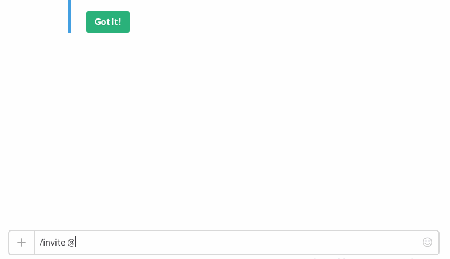
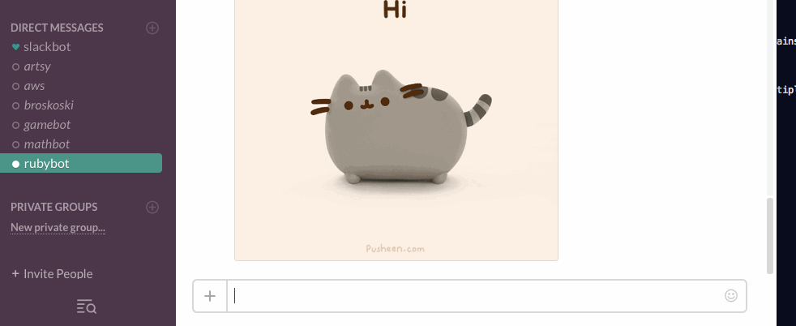
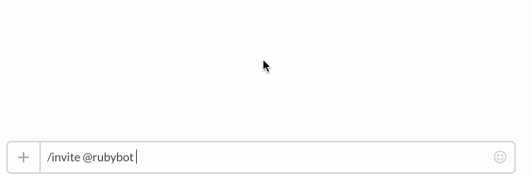
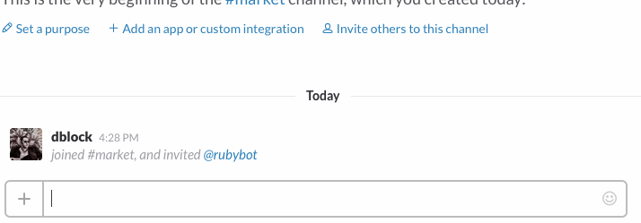
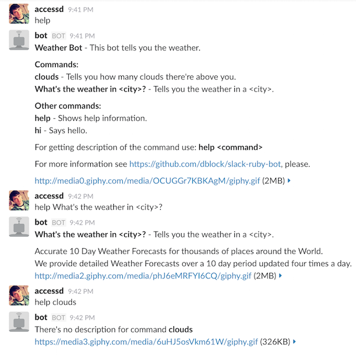

Slack-Ruby-Bot
==============

[](http://badge.fury.io/rb/slack-ruby-bot)
[](https://travis-ci.org/slack-ruby/slack-ruby-bot)
[](https://codeclimate.com/github/slack-ruby/slack-ruby-bot)

A generic Slack bot framework written in Ruby on top of [slack-ruby-client](https://github.com/slack-ruby/slack-ruby-client). This library does all the heavy lifting, such as message parsing, so you can focus on implementing slack bot commands. It also attempts to introduce the bare minimum number of requirements or any sorts of limitations. It's a Slack bot boilerplate.

If you are not familiar with Slack bots or Slack API concepts, you might want to watch [this video](http://code.dblock.org/2016/03/11/your-first-slack-bot-service-video.html).


## Useful to Me?

* If you are just trying to send messages to Slack, use [slack-ruby-client](https://github.com/slack-ruby/slack-ruby-client), which this library is built on top of.
* If you're trying to roll out a full service with Slack button integration, check out [slack-ruby-bot-server](https://github.com/slack-ruby/slack-ruby-bot-server), which uses this library.
* Otherwise, this piece of the puzzle will help you create a single bot instance for one team.

## Stable Release

You're reading the documentation for the **next** release of slack-ruby-bot.
Please see the documentation for the [last stable release, v0.11.2](https://github.com/slack-ruby/slack-ruby-bot/tree/v0.11.2) unless you're integrating with HEAD.
See [CHANGELOG](CHANGELOG.md) for a history of changes and [UPGRADING](UPGRADING.md) for how to upgrade to more recent versions.

## Usage

### A Minimal Bot

#### Gemfile

```ruby
source 'https://rubygems.org'

gem 'slack-ruby-bot'
gem 'async-websocket'
```

#### pongbot.rb

```ruby
require 'slack-ruby-bot'

class PongBot < SlackRubyBot::Bot
  command 'ping' do |client, data, match|
    client.say(text: 'pong', channel: data.channel)
  end
end

PongBot.run
```

After [registering the bot](DEPLOYMENT.md), run with `SLACK_API_TOKEN=... bundle exec ruby pongbot.rb`. Have the bot join a channel and send it a ping.


### A Production Bot

A typical production Slack bot is a combination of a vanilla web server and a websocket application that talks to the Slack Real Time Messaging API. See our [Writing a Production Bot](TUTORIAL.md) tutorial for more information.

### More Involved Examples

The following examples of bots based on slack-ruby-bot are listed in growing order of complexity.

* [slack-bot-on-rails](https://github.com/dblock/slack-bot-on-rails): A bot running on Rails and using React to display Slack messages on a website.
* [slack-mathbot](https://github.com/dblock/slack-mathbot): Slack integration with math.
* [slack-google-bot](https://github.com/dblock/slack-google-bot): A Slack bot that searches Google, including CSE.
* [slack-aws](https://github.com/dblock/slack-aws): Slack integration with Amazon Web Services.
* [slack-deploy-bot](https://github.com/accessd/slack-deploy-bot): A Slack bot that helps you to deploy your apps.
* [slack-gamebot](https://github.com/dblock/slack-gamebot): A game bot service for ping pong, chess, etc, hosted at [playplay.io](http://playplay.io).
* [slack-victorbot](https://github.com/uShip/victorbot): A Slack bot to talk to the Victorops service.

### Commands and Operators

Bots are addressed by name, they respond to commands and operators. You can combine multiple commands.

```ruby
class CallBot < SlackRubyBot::Bot
  command 'call', '呼び出し' do |client, data, match|
    client.say(channel: data.channel, text: 'called')
  end
end
```

Command match data includes `match['bot']`, `match['command']` and `match['expression']`. The `bot` match always checks against the `SlackRubyBot::Config.user` and `SlackRubyBot::Config.user_id` values obtained when the bot starts.

The `command` method can take strings, which will have be escaped with `Regexp.escape`, and regular expressions.

```ruby
class CallBot < SlackRubyBot::Bot
  command 'string with spaces', /some\s*regex+\?*/ do |client, data, match|
    client.say(channel: data.channel, text: match['command'])
  end
end
```

Operators are 1-letter long and are similar to commands. They don't require addressing a bot nor separating an operator from its arguments. The following class responds to `=2+2`.

```ruby
class MathBot < SlackRubyBot::Bot
  operator '=' do |client, data, match|
    # implementation detail
  end
end
```

Operator match data includes `match['operator']` and `match['expression']`. The `bot` match always checks against the `SlackRubyBot::Config.user` setting.

### Threaded Messages

To reply to a message in a thread you must provide a reference to the first message that initiated the thread, which is available as either `data.ts` if no threaded messages have been sent, or `data.thread_ts` if the message being replied to is already in a thread. See [message-threading](https://api.slack.com/docs/message-threading) for more information.

```ruby
command 'reply in thread' do |client, data, match|
  client.say(
    channel: data.channel,
    text: "let's avoid spamming everyone, I will tell you what you need in this thread",
    thread_ts: data.thread_ts || data.ts
  )
end
```

_Note that sending a message using only `thread_ts: data.ts` can cause some permanent issues where Slack will keep reporting inaccessible messages as unread. At the time of writing the slack team is still having problems clearing those notifications. As recommended by the slack documentation ..._

> A true parent's thread_ts should be used when replying. Providing a child's message ID will result in a new, detached thread breaking all context and sense.

_... the replies to a thread should always be sent to the message `ts` that started the thread, available as `thread_ts` for subsequent messages. Hence `data.thread_ts || data.ts`._

For additional options, including broadcasting, see [slack-ruby-client#chat_postMessage](https://github.com/slack-ruby/slack-ruby-client/blob/41539c647ac877400f20aa338aa42d2ebfd2866b/lib/slack/web/api/endpoints/chat.rb#L105).

### Bot Aliases

A bot will always respond to its name (eg. `rubybot`) and Slack ID (eg. `@rubybot`), but you can specify multiple aliases via the `SLACK_RUBY_BOT_ALIASES` environment variable or via an explicit configuration.

```
SLACK_RUBY_BOT_ALIASES=:pp: table-tennis
```

```ruby
SlackRubyBot.configure do |config|
  config.aliases = [':pong:', 'pongbot']
end
```

This is particularly fun with emoji.



Bots also will respond to a direct message, with or without the bot name in the message itself.



### Generic Routing

Commands and operators are generic versions of bot routes. You can respond to just about anything by defining a custom route.

```ruby
class Weather < SlackRubyBot::Bot
  match /^How is the weather in (?<location>\w*)\?$/ do |client, data, match|
    client.say(channel: data.channel, text: "The weather in #{match[:location]} is nice.")
  end
end
```



You can also capture multiple matchers with `scan`.

```ruby
class Market < SlackRubyBot::Bot
  scan(/([A-Z]{2,5})/) do |client, data, stocks|
    # lookup stock market price
  end
end
```



See [examples/market](examples/market/marketbot.rb) for a working example.

### Matching text in message attachments

You can respond to text in [attachments](https://api.slack.com/docs/message-attachments) with
`attachment`. It will scan `text`, `pretext` and `title` fields in each attachment until a first
match is found.

For example you can match [this example attachment](http://goo.gl/K0cLkH)
by its `title` with the following bot:

```ruby
class Attachment < SlackRubyBot::Bot
  attachment 'Slack API Documentation' do |client, data, match|
    client.say(channel: data.channel, text: "Matched by #{match.attachment_field}.")
    client.say(channel: data.channel, text: "The attachment's text: #{match.attachment.text}.")
  end
end
```

You can also define which fields in attachment object should be scanned.

Scan only a single field:

```ruby
class Attachment < SlackRubyBot::Bot
  attachment 'Slack API Documentation', :title do |client, data, match|
    # implementation details
  end
end
```

Scan multiple fields:

```ruby
class Attachment < SlackRubyBot::Bot
  attachment 'Slack API Documentation', %i[text pretext author_name] do |client, data, match|
    # implementation details
  end
end
```

### Providing description for your bot and commands

You can specify help information for bot or commands with `help` block, for example:

in case of bot:

```ruby
class WeatherBot < SlackRubyBot::Bot
  help do
    title 'Weather Bot'
    desc 'This bot tells you the weather.'

    command 'clouds' do
      desc 'Tells you how many clouds there\'re above you.'
    end

    command 'What\'s the weather in <city>?' do
      desc 'Tells you the weather in a <city>.'
      long_desc "Accurate 10 Day Weather Forecasts for thousands of places around the World.\n" \
        'Bot provides detailed Weather Forecasts over a 10 day period updated four times a day.'
    end
  end

  # commands implementation
end
```



in case of your own command:

```ruby
class Deploy < SlackRubyBot::Commands::Base
  help do
    title 'deploy'
    desc 'deploys your app'
    long_desc 'command format: *deploy <branch> to <env>* where <env> is production or staging'
  end
end
```

### Customize your command help output

If you've used the `help` block described above to document your
commands, you can provide your own implementation of outputting help
for commands like so:

```ruby
class Market < SlackRubyBot::Bot
  command 'help' do |client, data, match|
    user_command = match[:expression]
    help_attrs = SlackRubyBot::Commands::Support::Help.instance.find_command_help_attrs(user_command)
    client.say(channel: data.channel, text: "#{help_attrs.command_desc}\n\n#{help_attrs.command_long_desc}"
  end
end
```

### SlackRubyBot::Commands::Base

The `SlackRubyBot::Bot` class is DSL sugar deriving from `SlackRubyBot::Commands::Base`. For more involved bots you can organize the bot implementation into subclasses of `SlackRubyBot::Commands::Base` manually. By default a command class responds, case-insensitively, to its name. A class called `Phone` that inherits from `SlackRubyBot::Commands::Base` responds to `phone` and `Phone` and calls the `call` method when implemented.

```ruby
class Phone < SlackRubyBot::Commands::Base
  command 'call'

  def self.call(client, data, match)
    client.say(channel: data.channel, text: 'called')
  end
end
```

To respond to custom commands and to disable automatic class name matching, use the `command` keyword. The following command responds to `call` and `呼び出し` (call in Japanese).

```ruby
class Phone < SlackRubyBot::Commands::Base
  command 'call'
  command '呼び出し'

  def self.call(client, data, match)
    client.say(channel: data.channel, text: 'called')
  end
end
```

### Authorization

The framework does not provide any user authentication or command authorization capability out of the box. However, the `SlackRubyBot::Commands::Base` class does check every command invocation for permission prior to executing the command. The default method always returns true.

Therefore, subclasses of `SlackRubyBot::Commands::Base` can override the `permitted?` private method to provide its own authorization logic. This method is intended to be exploited by user code or external gems that want to provide custom authorization logic for command execution.

```ruby
class AuthorizedBot < SlackRubyBot::Commands::Base
  command 'phone home' do |client, data, match|
    client.say(channel: data.channel, text: 'Elliot!')
  end

  # Only allow user 'Uxyzabc' to run this command
  def self.permitted?(client, data, match)
    data && data.user && data.user == 'Uxyzabc'
  end
end
```

### Animated GIFs

The `SlackRubyBot::Client` implementation comes with GIF support. To enable it add `gem GiphyClient` (official Giphy SDK) or `gem giphy` (older SDK, deprecated) to your **Gemfile** and set a Giphy key via `ENV['GIPHY_API_KEY']`. Obtain one from [developers.giphy.com](https://developers.giphy.com).

**Note:** Bots send animated GIFs in default commands and errors.

```ruby
class Phone < SlackRubyBot::Commands::Base
  command 'call'

  def self.call(client, data, match)
    client.say(channel: data.channel, text: 'called', gif: 'phone')
    # Sends the text 'called' and a random GIF that matches the keyword 'phone'.
  end
end
```

Giphy API key is set automatically via `ENV['GIPHY_API_KEY']`. You can override this manually.

```ruby
Giphy.configure do |config|
  config.api_key = 'key'
end
```

With `GiphyClient` you can configure the default GIF rating, which supports Y, G, PG, PG-13, and R. The default value is `G`.

```ruby
Giphy.configure do |config|
  config.rating = 'Y' # illustrated content only, i.e. cartoons
end
```

If you use giphy for something else but don't want your bots to send GIFs you can set `ENV['SLACK_RUBY_BOT_SEND_GIFS']` or `SlackRubyBot::Config.send_gifs` to `false`. The latter takes precedence.

```ruby
SlackRubyBot.configure do |config|
  config.send_gifs = false
end
```

### Built-In Commands

Slack-ruby-bot comes with several built-in commands. You can re-define built-in commands, normally, as described above.

#### [bot name]

This is also known as the `default` command. Shows bot version and links.

#### [bot name] hi

Politely says 'hi' back.

#### [bot name] help

Get help.

### Hooks

Hooks are event handlers and respond to Slack RTM API [events](https://api.slack.com/events), such as [hello](lib/slack-ruby-bot/hooks/hello.rb) or [message](lib/slack-ruby-bot/hooks/message.rb). You can implement your own in a couple of ways:

#### Implement and register a Hook Handler

A Hook Handler is any object that respond to a `call` message, like a proc, instance of an object, class with a `call` class method, etc.

Hooks can be registered using different methods based on user preference / use case.
Currently someone can use one of the following methods:

* Pass `hooks` in `SlackRubyBot::Server` initialization.
* Register `hooks` on `SlackRubyBot::Server` using `on` class method.
* Register `hooks` on `SlackRubyBot::Server` using `on` instance method.


##### Hooks registration on `SlackRubyBot::Server` initialization

```ruby
SlackRubyBot::Server.new(hook_handlers: {
  hello: MyBot::Hooks::UserChange.new,
  user_change: [->(client, data) {  }, ->(client, data) {}]
})
```

##### Hooks registration on a `SlackRubyBot::Server` instance

```ruby
# Register an object that implements `call` method
class MyBot::Hooks::Hello
  def call(client, data)
    puts "Hello"
  end
end

server.on(:hello, MyBot::Hooks::Hello.new)

# or register a lambda function to handle the event
server.on(:hello, ->(client, data) { puts "Hello!" })
```

For example, the following hook handles [user_change](https://api.slack.com/events/user_change), an event sent when a team member updates their profile or data. This can be useful to update the local user cache when a user is renamed.

```ruby
module MyBot
  module Hooks
    class UserChange
      def call(client, data)
        # data['user']['id'] contains the user ID
        # data['user']['name'] contains the new user name
        # ...
      end
    end
  end
end
```

##### Hooks registration on `SlackRubyBot::Server` class

Example:

```ruby
module MyBot
  class MyServer < SlackRubyBot::Server
    on 'hello' do |client, data|
      # data['user']['id'] contains the user ID
      # data['user']['name'] contains the new user name
    end

    on 'user_change', ->(client, data) {
      # data['user']['id'] contains the user ID
      # data['user']['name'] contains the new user name
    }
  end
end
```

These will get pushed into the hook set on initialization.

Either by configuration, explicit assignment or hook blocks, multiple handlers can exist for the same event type.


#### Deprecated hook registration

Registering a hook method using `hooks.add` is considered deprecated and
will be removed on future versions.

```ruby
# [DEPRECATED]
server.hooks.add(:hello, MyBot::Hooks::UserChange.new)
server.hooks.add(:hello, ->(client, data) { puts "Hello!" })

```

### Message Loop Protection

By default bots do not respond to their own messages. If you wish to change that behavior, set `allow_message_loops` to `true`.

```ruby
SlackRubyBot.configure do |config|
  config.allow_message_loops = true
end
```

### Logging

By default bots set a logger to `$stdout` with `DEBUG` level. The logger is used in both the RealTime and Web clients.

Silence logger as follows.

```ruby
SlackRubyBot::Client.logger.level = Logger::WARN
```

If you wish to customize logger, set `logger` to your logger.

```ruby
SlackRubyBot.configure do |config|
  config.logger = Logger.new("slack-ruby-bot.log", "daily")
end
```

### Advanced Integration

You may want to integrate a bot or multiple bots into other systems, in which case a globally configured bot may not work for you. You may create instances of [SlackRubyBot::Server](lib/slack-ruby-bot/server.rb) which accepts `token`, `aliases` and `send_gifs`.

```ruby
EM.run do
  bot1 = SlackRubyBot::Server.new(token: token1, aliases: ['bot1'])
  bot1.start_async

  bot2 = SlackRubyBot::Server.new(token: token2, send_gifs: false, aliases: ['bot2'])
  bot2.start_async
end
```

For an example of advanced integration that supports multiple teams, see [slack-gamebot](https://github.com/dblock/slack-gamebot) and [playplay.io](http://playplay.io) that is built on top of it.

### Proxy Configuration

There are [several proxy options](https://github.com/slack-ruby/slack-ruby-client#web-client-options) that can be configured on `Slack::Web::Client`. You can also control what proxy options are used by modifying the `http_proxy` environment variable per [Net::HTTP's documentation](https://docs.ruby-lang.org/en/2.0.0/Net/HTTP.html#class-Net::HTTP-label-Proxies).

Note that Docker on OSX seems to incorrectly set the proxy, [causing `Faraday::ConnectionFailed`](https://github.com/slack-ruby/slack-ruby-bot/issues/155), `ERROR -- : Failed to open TCP connection to : (getaddrinfo: Name or service not known)`. You might need to manually unset `http_proxy` in that case, eg. `http_proxy="" bundle exec ruby ./my_bot.rb`.

### Model-View-Controller Design

The `command` method is essentially a controller method that receives input from the outside and acts upon it. Complex behaviors could lead to a long and difficult-to-understand `command` block. A complex `command` block is a candidate for separation into classes conforming to the Model-View-Controller pattern popularized by Rails.

The library provides three helpful base classes named `SlackRubyBot::MVC::Model::Base`, `SlackRubyBot::MVC::View::Base`, and `SlackRubyBot::MVC::Controller::Base`.

Testing a `command` block is difficult. As separate classes, the Model/View/Controller's behavior can be tested via `rspec` or a similar tool.

#### Controller

The Controller is the focal point of the bot behavior. Typically the code that would go into the `command` block will now go into an instance method in a Controller subclass. The instance method name should match the command name exactly (case sensitive).

As an example, these two classes are functionally equivalent.

Consider the following `Agent` class which is the simplest default approach to take.

```ruby
class Agent < SlackRubyBot::Bot
  command 'sayhello', 'alternate way to call hello' do |client, data, match|
    client.say(channel: data.channel, text: "Received command #{match[:command]} with args #{match[:expression]}")
  end
end
```

Using the MVC functionality, we would create a controller instead to encapsulate this function.
```ruby
class MyController < SlackRubyBot::MVC::Controller::Base
  def sayhello
    client.say(channel: data.channel, text: "Received command #{match[:command]} with args #{match[:expression]}")
  end
  alternate_name :sayhello, :alternate_way_to_call_hello
end
MyController.new(MyModel.new, MyView.new)
```
Note in the above example that the Controller instance method `sayhello` does not receive any arguments. When the instance method is called, the Controller class sets up some accessor methods to provide the normal `client`, `data`, and `match` objects. These are the same objects passed to the `command` block.

However, the Controller anticipates that the model and view objects should contain business logic that will also operate on the `client`, `data`, and `match` objects. The controller provides access to the model and view via the `model` and `view` accessor methods. The [inventory example](examples/inventory/inventorybot.rb) provides a full example of a Model, View, and Controller working together.

A Controller may need helper methods for certain work. To prevent the helper method from creating a route that the bot will respond to directly, the instance method name should begin with an underscore (e.g. `_my_helper_method`). When building the bot routes, these methods will be skipped.

Calling `alternate_name` after the method definition allows for method aliases similar to the regular `command` structure. When commands can be triggered by multiple text strings it's useful to have that ability map to the controller methods too.

Lastly, the Controller class includes `ActiveSupport::Callbacks` which allows for full flexibility in creating `before`, `after`, and `around` hooks for all methods. Again, see the [inventory example](examples/inventory/inventorybot.rb) for more information.

#### Model

A complex bot may need to read or write data from a database or other network resource. Setting up and tearing down these connections can be costly, so the model can do it once upon instantiation.

The Model also includes `ActiveSupport::Callbacks`.

```ruby
class MyModel < SlackRubyBot::MVC::Model::Base
  define_callbacks :sanitize
  set_callback :sanitize, :around, :sanitize_resource
  attr_accessor :_resource

  def initialize
    @db = setup_database_connection
  end

  def read(resource)
    self._resource = resource
    run_callbacks :sanitize do
      @db.select(:column1 => resource)
      # ... do some expensive work
    end
  end

  private

  def sanitize_resource
    self._resource.downcase
    result = yield
    puts "After read, result is #{result.inspect}"
  end
end
```

Like Controllers, the Model is automatically loaded with the latest version of the `client`, `data`, and `match` objects each time the controller method is called. Therefore the model will always have access to the latest objects when doing its work. It will typically only use the `data` and `match` objects.

Model methods are not matched to routes, so there is no restriction on how to name methods as there is in Controllers.

#### View

A typical bot just writes to a channel or uses the web client to react/unreact to a message. More complex bots will probably require more complex behaviors. These should be stored in a `SlackRubyBot::MVC::View::Base` subclass.

```ruby
class MyView < SlackRubyBot::MVC::View::Base
  define_callbacks :logit
  set_callbacks :logit, :around, :audit_trail

  def initialize
    @mailer = setup_mailer
    @ftp = setup_ftp_handler
  end

  def email_admin(message)
    run_callbacks :logit do
      @mailer.send(:administrator, message)
    end
  end

  def react_thumbsup
    client.web_client.reactions_add(
      name: :thumbs_up,
      channel: data.channel,
      timestamp: data.ts,
      as_user: true)
  end

  def react_thumbsdown
    client.web_client.reactions_remove(
      name: :thumbs_up,
      channel: data.channel,
      timestamp: data.ts,
      as_user: true)
  end

  private

  def audit_trail
    Logger.audit("Sending email at [#{Time.now}]")
    yield
    Logger.audit("Email sent by [#{Time.now}]")
  end
end
```
Again, the View will have access to the most up to date `client`, `data`, and `match` objects. It will typically only use the `client` and `data` objects.

View methods are not matched to routes, so there is no restriction on how to name methods as there is in Controllers.

### RSpec Shared Behaviors

Slack-ruby-bot ships with a number of shared RSpec behaviors that can be used in your RSpec tests.

* [behaves like a slack bot](lib/slack-ruby-bot/rspec/support/slack-ruby-bot/it_behaves_like_a_slack_bot.rb): A bot quacks like a Slack Ruby bot.
* [respond with slack message](lib/slack-ruby-bot/rspec/support/slack-ruby-bot/respond_with_slack_message.rb): The bot responds with a message.
* [respond with slack messages](lib/slack-ruby-bot/rspec/support/slack-ruby-bot/respond_with_slack_messages.rb): The bot responds with a multiple messages.
* [respond with error](lib/slack-ruby-bot/rspec/support/slack-ruby-bot/respond_with_error.rb): An exception is raised inside a bot command.

Require `slack-ruby-bot/rspec` in your `spec_helper.rb` along with the following dependencies in Gemfile.

```ruby
group :development, :test do
  gem 'rack-test'
  gem 'rspec'
  gem 'vcr'
  gem 'webmock'
end
```

### Useful Libraries

* [newrelic-slack-ruby-bot](https://github.com/dblock/newrelic-slack-ruby-bot): NewRelic instrumentation for slack-ruby-bot.

## Contributing

See [CONTRIBUTING](CONTRIBUTING.md).

## Upgrading

See [CHANGELOG](CHANGELOG.md) for a history of changes and [UPGRADING](UPGRADING.md) for how to upgrade to more recent versions.

## Copyright and License

Copyright (c) 2015-2016, [Daniel Doubrovkine](https://twitter.com/dblockdotorg), [Artsy](https://www.artsy.net) and [Contributors](CHANGELOG.md).

This project is licensed under the [MIT License](LICENSE.md).
