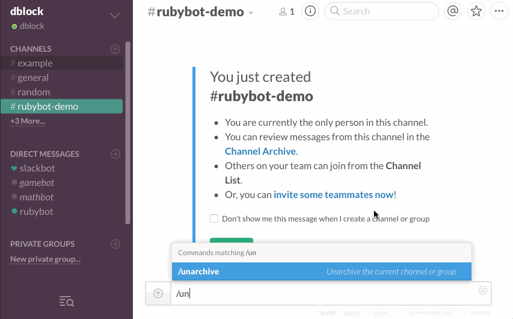

Slack-Ruby-Bot
==============

[](http://badge.fury.io/rb/slack-ruby-bot)
[](https://travis-ci.org/dblock/slack-ruby-bot)

A generic Slack bot framework written in Ruby. This library does all the heavy lifting so you can focus on implementing slack bot commands, without introducing unnecessary requirements or limitations. It's a Slack bot boilerplate.

## Usage

### A Minimal Bot

#### Gemfile

```ruby
source 'http://rubygems.org'

gem 'slack-ruby-bot'
```

#### pongbot.rb

```ruby
require 'slack-ruby-bot'

module PongBot
  class App < SlackRubyBot::App
  end

  class Ping < SlackRubyBot::Commands::Base
    def self.call(data, command, arguments)
      send_message data.channel, 'pong'
    end
  end
end

PongBot::App.instance.run
```

After [registering the bot](DEPLOYMENT.md), run with `SLACK_API_KEY=... bundle exec ruby pongbot.rb`. Have the bot join a channel and send it a ping.



### A Production Bot

A typical production Slack bot is a combination of a vanilla web server and a websocket application that talks to the Slack Real Time Messaging API. See our [Writing a Production Bot](TUTORIAL.md) tutorial for more information.

### More Involved Examples

The following examples of production-grade bots based on slack-ruby-bot are listed in growing order of complexity.

* [slack-mathbot](https://github.com/dblock/slack-mathbot): Slack integration with math.
* [slack-gamebot](https://github.com/dblock/slack-gamebot): A generic game bot for ping-pong, chess, etc.

### Commands and Operators

Bots are addressed by name and respond to commands and operators. By default a command class responds, case-insensitively, to its name. A class called `Phone` that inherits from `SlackRubyBot::Commands::Base` responds to `phone` and `Phone`. To respond to custom commands and to disable automatic class name matching, use the `command` keyword. The following command responds to `call` and `呼び出し` (call in Japanese).

```ruby
class Phone < SlackRubyBot::Commands::Base
  command 'call'
  command '呼び出し'
end
```

Operators are 1-letter long and are similar to commands. They don't require addressing a bot nor separating an operator from its arguments. The following class responds to `=2+2`.

```ruby
class Calculator < SlackRubyBot::Commands::Base
  operator '='
end
```

### Built-In Commands

Slack-ruby-bot comes with several built-in commands. You can re-define built-in commands, normally, as described above.

#### [bot name]

This is also known as the `default` command. Shows bot version and links.

#### [bot name] hi

Politely says 'hi' back.

#### [bot name] help

Get help.

## Contributing

See [CONTRIBUTING](CONTRIBUTING.md).

## Copyright and License

Copyright (c) 2015, Daniel Doubrovkine, Artsy and [Contributors](CHANGELOG.md).

This project is licensed under the [MIT License](LICENSE.md).
